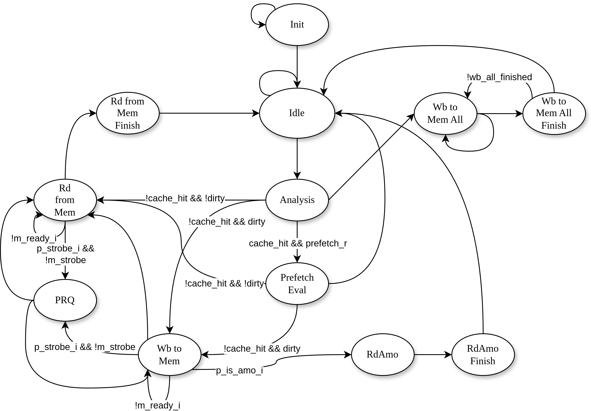
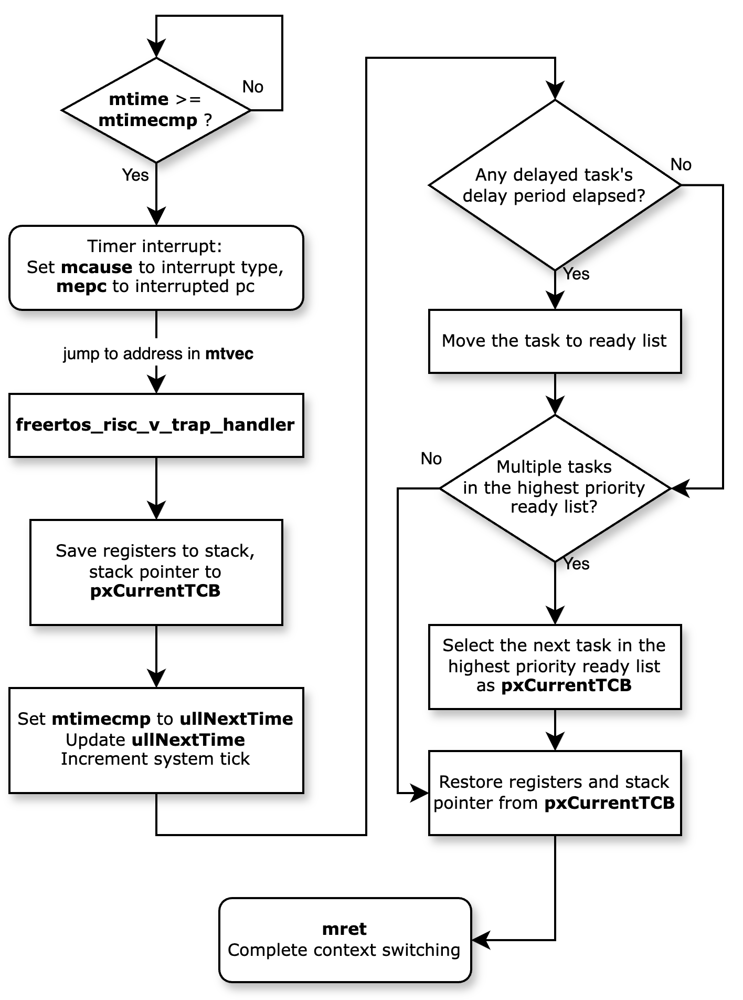

# RISC-V SoC Hardware Optimization

Hardware and software co-optimization projects on the Aquila RISC-V SoC platform, covering cache microarchitecture, RTOS profiling, and domain-specific accelerator design.

## Course Information

| | |
|---|---|
| **Course** | Microprocessor Systems: Principles and Implementation |
| **Institution** | National Yang Ming Chiao Tung University (NYCU) |
| **Instructor** | Prof. Chun-Jen Tsai |
| **Semester** | 2024 Fall |
| **Platform** | [Aquila SoC](https://github.com/eisl-nctu/aquila) — a RISC-V RV32IMA soft processor on Xilinx FPGA |

## Projects

### 1. [Cache Optimization](cache-optimization/)

**Problem:** Profiling the baseline data cache with a custom `dcache_profiler.v` revealed high miss latency (~54 cycles/op). Analysis showed the root cause: the dirty bit was never cleared after write-back, so every cache eviction triggered a memory write — even for clean lines.

**Approach:** Fixed the dirty bit clearing logic, then redesigned the cache controller FSM to remove the redundant `WbToMemFinish` state. Also implemented an LRU replacement policy (`lru_matrix.v`) and a stride-based prefetching algorithm. Exhaustively profiled 6 configurations (4KB/8KB × 2/4/8-way) to find the optimal trade-off.

**Results:** Miss latency reduced by **19.87%** (54.58 → 43.73 cycles/op). Best configuration achieved **16.11% overall speedup** (30,517 ms → 24,395 ms on π 5000-digit computation).

[Full Report (PDF)](cache-optimization/docs/report.pdf)

---

### 2. [RTOS Profiling](rtos-profiling/)

**Problem:** FreeRTOS ran on Aquila but lacked visibility into how much execution time was consumed by OS overhead — context switching and synchronization costs were unknown.

**Approach:** Designed a hardware profiler in Verilog, integrated into the SoC, to measure cycle-accurate latency from each timer interrupt to `mret`. Profiled three time quantum settings (5/10/20 ms) and separately measured mutex take/give overhead by instrumenting `xSemaphoreTake()` and `xSemaphoreGive()`.

**Results:** Context switching overhead dropped from **5.18‰** to **1.28‰** of total execution as quantum increased from 5 ms to 20 ms, while per-IRQ latency stayed constant (~1,000 cycles) — confirming the overhead is purely frequency-driven. Mutex synchronization accounted for **19.00‰** of total execution.

[Full Report (PDF)](rtos-profiling/docs/report.pdf)

---

### 3. [DSA Accelerator](dsa-accelerator/)

**Problem:** A CNN-based OCR inference running in software on Aquila took ~25.5 seconds — the bottleneck was the repeated floating-point multiply-accumulate operations in convolution and fully-connected layers.

**Approach:** Designed a domain-specific accelerator (`dsa.v`) for fused multiply-add using Xilinx floating-point IP, with memory-mapped I/O. Added 128 KB tightly coupled memory (`sram_sp.v`) for storing CNN weights and feature maps to bypass cache latency. Built an embedded cycle profiler inside the DSA to separate data feeding time from computation time, guiding further optimization on the software side.

**Results:** DSA alone achieved **7.43x speedup**. Full optimization (DSA + TCM + SW) reached **7.77x speedup** (25,483 ms → 3,278 ms). Profiler showed computation still accounts for ~70% of DSA time, suggesting parallelizing floating-point units as the next improvement.

[Full Report (PDF)](dsa-accelerator/docs/report.pdf)

---

## Tech Stack

- **HDL:** Verilog (RTL design, cache controller, DSA, TCM, profiler modules)
- **ISA:** RISC-V RV32IMA
- **FPGA:** Digilent Arty A7-100T (Xilinx Artix-7), Vivado 2024.1
- **OS:** FreeRTOS
- **Software:** C (bare-metal and RTOS applications), GCC 13.2.0

## Acknowledgement

These projects are built on the [Aquila SoC](https://github.com/eisl-nctu/aquila) platform developed by Prof. Chun-Jen Tsai and the Embedded Intelligent Systems Lab (EISL) at NYCU. The original hardware design is licensed under BSD-3-Clause.
