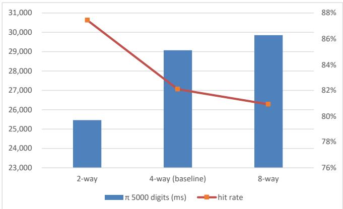
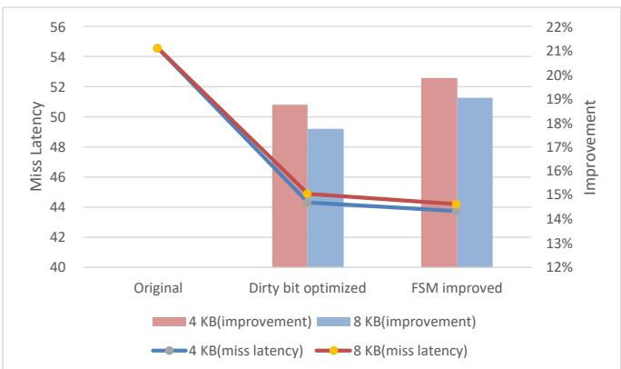
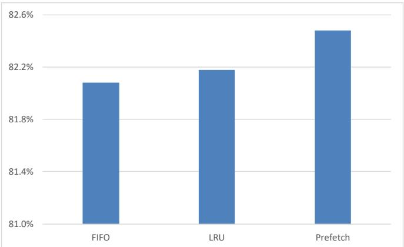
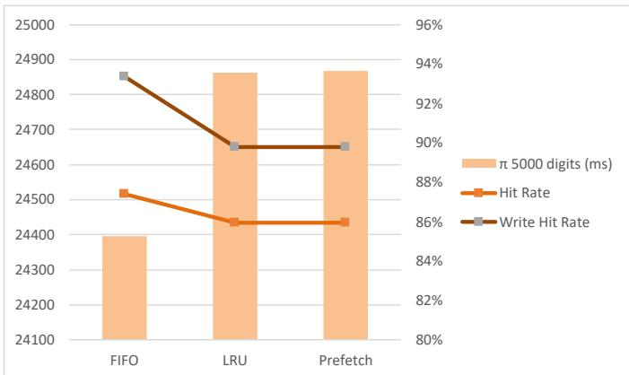

# Cache Optimization

Profiling and optimizing the L1 data cache of the Aquila RISC-V SoC. A custom hardware profiler exposed abnormally high miss latency, which was traced to a dirty-bit bug in the baseline cache. Fixing it, together with a cache controller redesign, cut miss latency by **19.87%**; the best configuration ran **16.11% faster** than the baseline.

## Problem

The baseline data cache is 4-way set-associative, write-back, and uses FIFO replacement. Profiling a π computation (5,000 digits) showed an average miss latency of about **54.6 cycles per operation**.

The cause turned out to be in how dirty bits were maintained. When a line was refilled from memory, its dirty bit was only updated on a *write* miss. On a *read* miss, the new line kept the dirty bit of the line it replaced. In effect, once a cache slot became dirty it stayed dirty until reset, so clean lines were written back to memory every time they were evicted. Data was always correct, so the bug caused no functional errors—only slower misses.

## Approach

1. **Profiler** — built `dcache_profiler.v` to measure hit rate and per-operation latency of reads and writes.
2. **Configuration sweep** — tested 4 KB / 8 KB caches with 2-, 4-, and 8-way associativity.
3. **Dirty-bit fix** — update the dirty bit on every refill, writing 0 for read misses and 1 for write misses.
4. **FSM redesign** — removed the redundant `WbtoMemFinish` state.
5. **Replacement policy** — added a matrix-based LRU policy as an alternative to FIFO.
6. **Prefetching** — added a stride-based prefetcher that keeps serving cache hits while a prefetch is in flight.

Each experiment computed π to 5,000 digits six times; the first run was a warm-up and the reported value is the average of the remaining five.

## Files I Wrote or Modified

All other files under `rtl/` are from the original [Aquila SoC](https://github.com/eisl-nctu/aquila).

| File | Status | Changes |
|------|--------|---------|
| [`rtl/core_rtl/dcache.v`](rtl/core_rtl/dcache.v) | Modified | Dirty-bit fix; FSM redesign; associativity made a parameter (`N_WAYS`); LRU/FIFO selection; stride prefetcher with a `PrefetchEval` and `PRQ` state |
| [`rtl/core_rtl/dcache_profiler.v`](rtl/core_rtl/dcache_profiler.v) | **New** | Hardware profiler for hit counts and latency |
| [`rtl/core_rtl/lru_matrix.v`](rtl/core_rtl/lru_matrix.v) | **New** | Matrix-based LRU tracker, one instance per cache set |
| [`rtl/core_rtl/aquila_config.vh`](rtl/core_rtl/aquila_config.vh) | Modified | Macros for cache size, associativity, replacement policy, profiler, and prefetching |
| [`rtl/core_rtl/aquila_top.v`](rtl/core_rtl/aquila_top.v), [`rtl/core_rtl/core_top.v`](rtl/core_rtl/core_top.v) | Modified | Instantiate and wire up the profiler; pass associativity to the cache |

## Design Details

### Profiler

The profiler watches the processor's data requests and the cache's hit signal and state. Counting starts when the program counter reaches the entry of the π computation and stops at its exit, so start-up code does not skew the results. It records:

- the number of read and write requests, and how many of each were hits;
- the total cycles spent on reads and writes, and on read hits and write hits.

From these, average hit and miss latency per operation can be derived. The counters are marked for debug and read out through the Vivado Integrated Logic Analyzer.

### Dirty-Bit Fix

In the baseline, the write enable of the dirty-bit RAM during a refill was:

```verilog
else if (S == RdfromMem && m_ready_i && rw)     // only on write misses
```

Removing `&& rw` makes every refill overwrite the dirty bit. The value written is still `rw`, so read misses now clear it and write misses set it.

### FSM Redesign

The baseline went `WbtoMem → WbtoMemFinish → RdfromMem` on a dirty miss. The redesigned FSM removes the intermediate state and moves directly from `WbtoMem` to `RdfromMem` once memory signals ready, avoiding an extra stall on every dirty miss. The figure below shows the final FSM, including the prefetch states.


### LRU Replacement

Each set has an $N \times N$ bit matrix ($N$ = number of ways). When way $k$ is accessed, row $k$ is set to all 1s and column $k$ to all 0s. The least recently used way is the row that contains only 0s. FIFO or LRU is chosen with a macro in `aquila_config.vh`.

### Stride Prefetching

The prefetcher compares the line addresses of consecutive requests. When the difference (stride) stays the same, it fetches the next line ahead of time. While a prefetch is using the memory bus, the cache moves to a `PRQ` (prefetch request) state:

- cache hits are served immediately;
- cache misses wait until the prefetch finishes and are then re-analyzed, since the prefetched line may be the one requested.

## Results

### Cache Configuration

Baseline cache (FIFO, original dirty-bit handling):

| Size | Associativity | Time (ms) | Hit Rate | Miss Latency (cycles/op) |
|------|---------------|----------:|---------:|-------------------------:|
| 4 KB | 2-way | 30,534 | 79.97% | 54.65 |
| 4 KB | 4-way (baseline) | 30,517 | 79.97% | 54.58 |
| 4 KB | 8-way | 30,517 | 79.97% | 54.58 |
| 8 KB | 2-way | 25,445 | 87.42% | 54.58 |
| 8 KB | 4-way (baseline) | 29,079 | 82.08% | 54.58 |
| 8 KB | 8-way | 29,860 | 80.92% | 54.55 |

At 4 KB, associativity makes almost no difference. At 8 KB, fewer ways means more sets, and 2-way gives a clearly higher hit rate and the best time.



### Dirty-Bit Fix

Same configurations after the fix. Hit rates are unchanged, while miss latency drops across the board:

| Size | Associativity | Time (ms) | Hit Rate | Miss Latency (cycles/op) |
|------|---------------|----------:|---------:|-------------------------:|
| 4 KB | 2-way | 27,968 | 79.97% | 44.38 |
| 4 KB | 4-way | 27,957 | 79.97% | 44.34 |
| 4 KB | 8-way | 27,972 | 79.97% | 44.40 |
| 8 KB | 2-way | **24,395** | 87.42% | 47.89 |
| 8 KB | 4-way | 26,913 | 82.08% | 44.89 |
| 8 KB | 8-way | 27,434 | 80.92% | 44.35 |

### Miss Latency

4-way associativity, FIFO, compared with the original cache of the same size:

| Size | Stage | Miss Latency (cycles/op) | Improvement |
|------|-------|-------------------------:|------------:|
| 4 KB | Original | 54.58 | — |
| 4 KB | Dirty-bit fix | 44.34 | 18.76% |
| 4 KB | + FSM redesign | **43.73** | **19.87%** |
| 8 KB | Original | 54.58 | — |
| 8 KB | Dirty-bit fix | 44.89 | 17.75% |
| 8 KB | + FSM redesign | 44.19 | 19.03% |

Almost all of the gain comes from the dirty-bit fix; the FSM redesign adds about one more percentage point.



### Replacement Policy and Prefetching

8 KB, 4-way:

| | FIFO | LRU | Prefetch |
|---|---:|---:|---:|
| Hit Rate | 82.08% | 82.18% | **82.48%** |
| Read Hit Rate | 80.58% | 80.58% | 79.21% |
| Write Hit Rate | 93.36% | 84.17% | 83.30% |



### Best Configuration

8 KB, 2-way, with the dirty-bit fix:

| | FIFO | LRU | Prefetch |
|---|---:|---:|---:|
| Time (ms) | **24,395** | 24,863 | 24,867 |
| Hit Rate | 87.42% | 85.92% | 85.93% |
| Write Hit Rate | 93.36% | 89.77% | 89.77% |
| Speedup vs. baseline* | **16.11%** | 14.50% | 14.48% |

\* Baseline: 8 KB, 4-way, FIFO, original cache (29,079 ms).



## Discussion

- **Write-back cost dominated.** Removing unnecessary write-backs improved every configuration, far more than any change to hit rate.
- **LRU and prefetching did not help the best configuration.** The 8 KB 2-way cache already had a very high write hit rate under FIFO. LRU and prefetching lowered the write hit rate, so overall performance dropped slightly. Prefetching is also sensitive to the access pattern, so its benefit varies between configurations.
- **Possible next steps:**
  - add a write buffer and reorder the FSM to read the new line before writing back the old one, so write-backs happen in the background;
  - let processor requests interrupt an in-flight prefetch;
  - improve prefetch accuracy, since the hit-latency cost of prefetching is small but wrong prefetches waste bandwidth.

## Build and Run

**Hardware** (Vivado 2024.1, Digilent Arty A7-100T):

```bash
cd cache-optimization
vivado -mode batch -source build.tcl   # creates the aquila_mpd project
```

Open `aquila_mpd/aquila_mpd.xpr`, then run synthesis, implementation, and bitstream generation. Cache size, associativity, replacement policy, profiler, and prefetching are selected in `rtl/core_rtl/aquila_config.vh`.

**Software** (RISC-V GNU toolchain, `riscv32-unknown-elf`):

```bash
cd sw/pi
make RISCV=/path/to/riscv/toolchain
```

Send `pi.elf` to the board through the UART boot loader.

## Report

[Full report (PDF)](docs/report.pdf)
