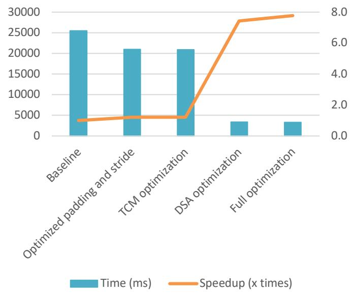
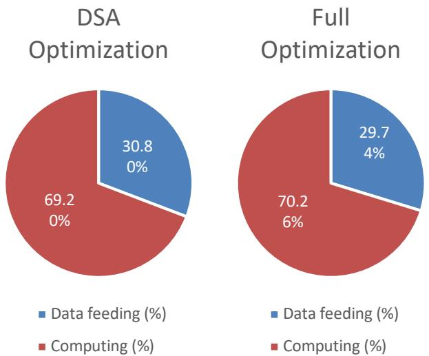

# Domain-Specific Accelerator (DSA)

Hardware/software co-optimization of CNN inference on the Aquila RISC-V SoC. A memory-mapped floating-point multiply-add accelerator, a tightly coupled memory (TCM), and software changes together brought a handwritten-character recognition CNN from **25.5 s to 3.3 s — a 7.77× speedup**.

## Problem

A small CNN for handwritten character recognition (OCR) ran entirely in software on Aquila and took about **25.5 seconds**. Most of the time was spent in the multiply-accumulate loops of the convolutional and fully connected layers, all done with software floating-point arithmetic.

## Approach

1. **DSA** — a fused multiply-add unit (`A × B + C`) built around the Xilinx Floating-Point IP and accessed through memory-mapped registers. The result is fed back as the next `C`, so a whole dot product runs on the accelerator without the processor reading back intermediate sums.
2. **TCM** — 128 KB of on-chip block RAM mapped into the device address space, used for CNN weights and feature maps so they bypass the cache and external DRAM.
3. **Software** — the CNN code uses the DSA for dot products, allocates its buffers in the TCM, and hard-codes padding (0) and stride (1) in the convolution loops.
4. **Profiler** — counters inside the DSA split its busy time into *data feeding* and *computing*, to show where the remaining bottleneck is.

Each optimization can be turned on or off independently, so its effect can be measured on its own.

## Files I Wrote or Modified

All other files are from the original [Aquila SoC](https://github.com/eisl-nctu/aquila) and its CNN OCR example.

**Hardware**

| File | Status | Changes |
|------|--------|---------|
| [`rtl/soc_rtl/dsa.v`](rtl/soc_rtl/dsa.v) | **New** | Memory-mapped FMA accelerator with result feedback and a built-in profiler |
| [`rtl/soc_rtl/sram_sp.v`](rtl/soc_rtl/sram_sp.v) | **New** | Single-port block RAM with byte enables, used as the TCM |
| [`rtl/soc_rtl/soc_top.v`](rtl/soc_rtl/soc_top.v) | Modified | Address decoding for the DSA (`0xC4xx_xxxx`) and TCM (`0xC6xx_xxxx`); instantiates both modules |
| [`rtl/core_rtl/aquila_config.vh`](rtl/core_rtl/aquila_config.vh) | Modified | Macros to enable the DSA, its profiler, and the TCM |
| [`rtl/core_rtl/aquila_top.v`](rtl/core_rtl/aquila_top.v) | Modified | Debug probes on bus signals |

**Software**

| File | Changes |
|------|---------|
| [`sw/cnn_ocr/inc_cnn/config.h`](sw/cnn_ocr/inc_cnn/config.h) | Switches for each optimization; DSA register addresses and access macros |
| [`sw/cnn_ocr/inc_cnn/convolutional_layer.h`](sw/cnn_ocr/inc_cnn/convolutional_layer.h) | Convolution dot products on the DSA; fixed padding and stride |
| [`sw/cnn_ocr/inc_cnn/fully_connected_layer.h`](sw/cnn_ocr/inc_cnn/fully_connected_layer.h) | Fully connected dot products on the DSA |
| [`sw/cnn_ocr/inc_cnn/layer.h`](sw/cnn_ocr/inc_cnn/layer.h), [`sw/cnn_ocr/file_read.c`](sw/cnn_ocr/file_read.c) | Layer buffers, weights, and labels allocated in the TCM |
| [`sw/cnn_ocr/cnn_ocr.c`](sw/cnn_ocr/cnn_ocr.c) | DSA register pointers; TCM release at exit |
| [`sw/elibc/stdlib.c`](sw/elibc/stdlib.c), [`sw/elibc/stdlib.h`](sw/elibc/stdlib.h) | `tcm_alloc()` / `free_tcm()` allocator for the TCM |

## Design Details

### DSA Register Interface

The DSA occupies four 32-bit registers:

| Address | Register | Access |
|---------|----------|--------|
| `0xC400_0000` | A | write operand |
| `0xC400_0004` | B | write operand |
| `0xC400_0008` | C | write initial value / read result |
| `0xC400_000C` | Control | write to reset or start computing |

Internally, A, B, and C drive the three AXI4-Stream inputs of the floating-point FMA unit. When a result comes out, it is written back into C, so each new pair of operands computes `A × B + (previous result)`. A dot product in software therefore looks like this:

```c
SET_DSA(0.);                          // clear the control register, C = 0
for (i = 0; i < n; i++)
    DSA_MPA(w[i], x[i]);              // write A and B; the DSA accumulates into C
sum = DSA_RESULT();                   // read C once at the end
```

The DSA tracks how many operands are still in flight, and a read of C is held until the last result has been accumulated.

### Floating-Point IP

`dsa.v` instantiates the Xilinx Floating-Point IP as `floating_point_0`. `build.tcl` creates it with the operation set to FMA (add) and an active-low reset; the remaining settings are the IP's defaults for that operation:

| Setting | Value |
|---------|-------|
| Operation | FMA (fused multiply-add) |
| Precision | Single |
| Latency | 20 cycles |
| DSP usage | Full |
| Optimization goal | Resources |

### Tightly Coupled Memory

`sram_sp.v` provides 32,768 words (128 KB) of block RAM at `0xC600_0000`. On the software side, `tcm_alloc()` is a simple bump allocator over that range, and `free_tcm()` releases everything at once. A `MALLOC()` macro in `config.h` makes the CNN code use either `tcm_alloc()` or the regular `malloc()`, depending on whether the TCM is enabled.

### Profiler

Two 64-bit counters inside the DSA measure:

- **computing time**: cycles from when all inputs have been fed into the FMA unit until a valid result comes out;
- **data feeding time**: the rest of the DSA's busy cycles, spent waiting for the processor to deliver operands.

## Results

Time to classify the test images (lower is better):

| Configuration | Time (ms) | Speedup |
|---------------|----------:|--------:|
| Baseline | 25,482.6 | 1.00× |
| Padding and stride optimized | 21,025.4 | 1.21× |
| TCM only | 20,895.6 | 1.22× |
| DSA only | 3,431.0 | 7.43× |
| **Full optimization** | **3,278.0** | **7.77×** |



DSA time breakdown from the built-in profiler:

| Configuration | Data feeding | Computing |
|---------------|-------------:|----------:|
| DSA only | 30.80% | 69.20% |
| Full optimization | 29.74% | 70.26% |



## Discussion

- **The DSA dominates.** It alone gives 7.43×, while fixing padding and stride or moving data to the TCM gives about 1.2× each.
- **The gains add up rather than multiply.** All three optimizations together reach 7.77×, only slightly better than the DSA alone. They target different parts of the program, and once the DSA has removed most of the arithmetic cost, the other improvements apply to a much smaller share of the remaining time.
- **Computation is still the bottleneck.** About 70% of the DSA's time is spent computing, and this barely changes with the TCM. Faster data delivery would help, but more parallel arithmetic would help more.
- **Possible next steps:**
  - instantiate several FMA units to compute multiple products of a dot product in parallel;
  - make better use of the AXI4-Stream interface with wider data ports and larger input buffers, so the DSA could fetch data directly from memory;
  - in software, avoid recomputing values that stay the same across channels.

## Build and Run

**Hardware** (Vivado 2024.1, Digilent Arty A7-100T):

```bash
cd dsa-accelerator
vivado -mode batch -source build.tcl   # creates the aquila_mpd project
```

`build.tcl` also generates the floating-point IP. Open `aquila_mpd/aquila_mpd.xpr`, then run synthesis, implementation, and bitstream generation. The DSA, its profiler, and the TCM are enabled in `rtl/core_rtl/aquila_config.vh`.

**Software** (RISC-V GNU toolchain, `riscv32-unknown-elf`):

```bash
cd sw/cnn_ocr
make RISCV=/path/to/riscv/toolchain
```

Each optimization is selected in `sw/cnn_ocr/inc_cnn/config.h` (`ENABLE_PADDING_STRIDE_OPTIMIZED`, `ENABLE_TCM`, `ENABLE_DSA`). Copy `weights.dat`, `test-images.dat`, and `test-labels.dat` from `sw/cnn_ocr/data/` to the root of the SD card, then send `cnn_ocr.elf` to the board through the UART boot loader.

## Report

[Full report (PDF)](docs/report.pdf)
