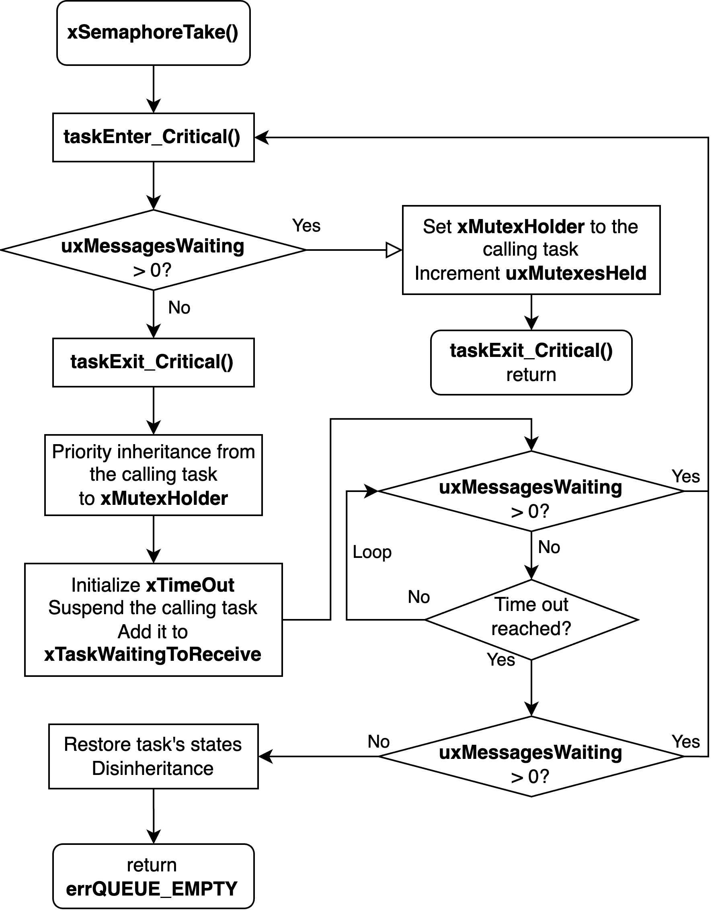

# RTOS Profiling

Measuring the cost of FreeRTOS context switching and mutex synchronization on the Aquila RISC-V SoC with a cycle-accurate hardware profiler. Context-switching overhead fell from **5.18‰ to 1.28‰** of total execution as the time quantum grew from 5 ms to 20 ms, while the cost per timer interrupt stayed at about **1,000 cycles**.

## Problem

FreeRTOS runs on Aquila, but how much of the execution time goes to the operating system itself was unknown. Software timers would disturb the very code being measured, so the measurement needs to be done in hardware.

## Approach

1. **Study the kernel** — trace how FreeRTOS creates tasks, starts the scheduler, handles timer interrupts, and implements mutexes on RISC-V.
2. **Hardware profiler** — build `profiler.v`, which watches the program counter, the instruction stream, and the timer interrupt line, and counts cycles without affecting the program.
3. **Context switching** — run the demo program with time quanta of 5, 10, and 20 ms and compare the overhead.
4. **Synchronization** — measure the cycles spent in `xSemaphoreTake()` and `xSemaphoreGive()`.

The workload is the `rtos_run` demo: two tasks of equal priority increment a shared counter, protected by a mutex. Each result is averaged over five runs after a warm-up run.

## Files I Wrote or Modified

All other files are from the original [Aquila SoC](https://github.com/eisl-nctu/aquila) and its FreeRTOS demo.

| File | Status | Changes |
|------|--------|---------|
| [`rtl/core_rtl/profiler.v`](rtl/core_rtl/profiler.v) | **New** | Hardware profiler for total, context-switching, and mutex cycles |
| [`rtl/core_rtl/aquila_top.v`](rtl/core_rtl/aquila_top.v) | Modified | Instantiates the profiler and connects the fetch PC, instruction, and timer interrupt |
| [`rtl/core_rtl/core_top.v`](rtl/core_rtl/core_top.v) | Modified | Exposes the writeback-stage PC to the profiler |
| [`rtl/core_rtl/aquila_config.vh`](rtl/core_rtl/aquila_config.vh) | Modified | Macro to enable the profiler |
| [`sw/rtos_run/rtos_run.c`](sw/rtos_run/rtos_run.c) | Modified | Mutex enabled (`USE_MUTEX 1`) |
| [`sw/rtos_run/Makefile`](sw/rtos_run/Makefile) | Modified | Rebuild FreeRTOS when `FreeRTOSConfig.h` changes, so a new tick rate actually takes effect |

## How FreeRTOS Switches Context on Aquila

When `mtime` reaches `mtimecmp` in the CLINT, the processor takes a timer interrupt and jumps to `freertos_risc_v_trap_handler`. The handler saves the current task's registers, schedules the next tick, and increments the system tick. Tasks whose delay has expired are moved to the ready list. If more than one task is ready at the highest priority, time slicing picks the next one as `pxCurrentTCB`. Its registers are restored, and `mret` resumes it.


A mutex in FreeRTOS is a queue with at most one item. `xSemaphoreTake()` takes the mutex if it is free. Otherwise, the calling task is blocked and the mutex holder temporarily inherits its priority, so the holder can finish and release the mutex sooner. `xSemaphoreGive()` releases the mutex and wakes the highest-priority waiting task.



## Design Details

### Profiler

The profiler counts cycles between hardware events, so it adds no instructions to the program:

| Measurement | Starts when | Stops when |
|-------------|-------------|------------|
| Total execution | the fetch PC reaches the entry of `main` | the fetch PC reaches `vTaskDelete()` in Task 1 (Task 1 finishes last) |
| Context switching | the timer interrupt line rises | an `mret` instruction is fetched |
| Mutex take / give | the writeback PC reaches a call to `xSemaphoreTake()` / `xSemaphoreGive()` | the writeback PC reaches the function's return |

It also counts timer interrupts. The counters are read out through the Vivado Integrated Logic Analyzer.

The function addresses are fixed constants in `profiler.v`, so they must be updated from the disassembly whenever the program is recompiled. The mutex counters are compiled in only when `ENABLE_MUTEX_PROFILER` is defined.

## Results

### Context Switching

The time quantum is set with `configTICK_RATE_HZ` in `FreeRTOSConfig.h`. Latency is in clock cycles; share is relative to total execution cycles.

| Time quantum | 5 ms | 10 ms | 20 ms |
|--------------|-----:|------:|------:|
| Total latency (cycles) | 1,047,753.0 | 462,058.6 | 258,395.6 |
| Share of execution | 5.18‰ | 2.29‰ | **1.28‰** |
| Timer interrupts | 969.6 | 484 | 242.2 |
| Latency per interrupt (cycles) | 1,080.60 | 954.67 | 1,066.87 |

Doubling the time quantum halves the number of timer interrupts, and the total overhead falls accordingly. The cost of each interrupt stays at about 1,000 cycles. Handling a tick costs about the same whether or not it ends in a task switch, so the overhead depends only on how often interrupts occur.

### Synchronization

Measured with a 20 ms time quantum to minimize interference from context switching:

| | Mutex take | Mutex give | Total |
|---|---:|---:|---:|
| Latency (cycles) | 1,891,648.6 | 1,950,403.0 | 3,842,051.6 |
| Share of execution | 9.35‰ | 9.64‰ | **19.00‰** |

Mutex operations cost far more than context switching, about 15 times as much as the 1.28‰ above.

## Discussion

- **Choosing a time quantum is a trade-off.** A longer quantum reduces OS overhead, but tasks wait longer before they get the CPU, so the system responds more slowly.
- **The mutex measurement is an upper bound.** If a timer interrupt arrives while a task is inside `xSemaphoreTake()` or `xSemaphoreGive()`, the interrupt handling time is also counted. A 20 ms quantum reduces this effect but does not remove it. A more precise profiler would pause the mutex counters during interrupt handling.

## Build and Run

**Hardware** (Vivado 2024.1, Digilent Arty A7-100T):

```bash
cd rtos-profiling
vivado -mode batch -source build.tcl   # creates the aquila_mpd project
```

Open `aquila_mpd/aquila_mpd.xpr`, then run synthesis, implementation, and bitstream generation. The profiler is enabled in `rtl/core_rtl/aquila_config.vh`; define `ENABLE_MUTEX_PROFILER` as well to measure mutex operations.

**Software** (RISC-V GNU toolchain, `riscv32-unknown-elf`):

```bash
cd sw/rtos_run
make RISCV=/path/to/riscv/toolchain
```

Set the time quantum with `configTICK_RATE_HZ` in `FreeRTOSConfig.h` (200, 100, and 50 Hz for 5, 10, and 20 ms), then send `rtos_run.elf` to the board through the UART boot loader. After recompiling, update the function addresses in `profiler.v` to match the new disassembly.

## Report

[Full report (PDF)](docs/report.pdf)
